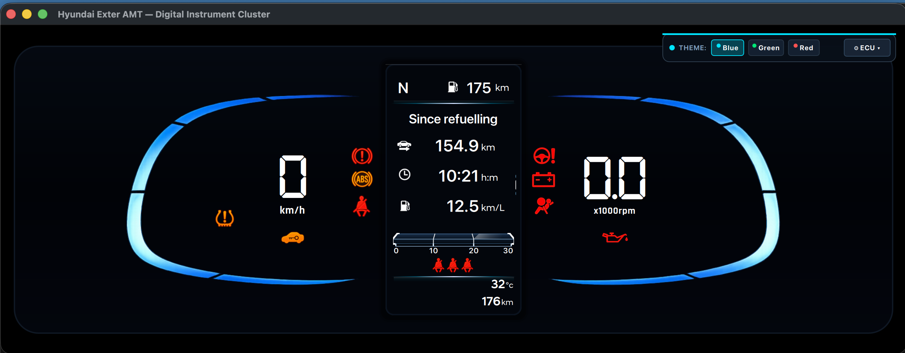

# Hyundai Exter AMT Digital Instrument Cluster HMI

A high-fidelity, real-time automotive digital instrument cluster HMI for the **Hyundai Exter AMT**, built using **Qt 6 (QML / Qt Quick)** and modern **C++20**.

<p align="center">
  
</p>

---

## 📸 Key Features

### 1. 🏎️ Dual Digital Dial Gauges (Speedometer & Tachometer)
- **Speedometer**: Custom-styled 7-segment digital speed readout (`0–180 km/h`) flanked by authentic segmented speed arc lines.
- **Tachometer (RPM)**: Precision x1000 RPM digital gauge with realistic torque curve & shift points.
- **AMT Transmission**: Automatic gear indicators (`P`, `R`, `N`, `D`, `1–5`) and manual sequential shift modes (`M1–M5`).

### 2. 🖥️ Central 4.2-inch TFT Multi-Function Display (MFD)
- **Top Header Status**: Active gear, dynamic fuel range (DTE km), ambient temperature (`32°C`), and total odometer (`176 km`).
- **Rising Spotlight Tab Bar**: 3 category tabs (`Trip / Car`, `User Settings / Cog`, `TPMS / Info`) with theme-colored spotlight flare emerging from the curved divider line.
- **Non-Touch Automotive Interaction**: Fully operated via steering wheel switches (`▲ UP`, `▼ DOWN`, `OK`, `↩ BACK`, `INFO`) or keyboard shortcuts.

### 3. 📊 Mode 1: Trip Computer & 3D ECO Gauge
- **3-Page Trip Computer**:
  - `Current trip` (Distance km, Driving time, Average fuel economy km/L)
  - `Since refuelling`
  - `Since last reset`
- **Instant ECO Gauge**: 3D extruded curved gauge with dynamic volumetric blue/green/red glow.

### 4. ⚙️ Mode 2: OEM User Settings System
- Multi-level hierarchical menu with smooth viewport auto-centering and vertical scrollbar:
  - **Driver assistance**: `↩ Back` ➔ `Warning methods` ➔ `Warning volume` (`High`, `Medium ◉`, `Low`).
  - **Cluster**: `↩ Back` ➔ `Cluster theme >` (Theme A, Theme B, Theme C) + interactive checkboxes (`Wiper/Lights display ☑`, `Icy road warning ☑`, `Welcome sound ☑`).
  - **Lights**: `↩ Back` ➔ `Illumination >` (3D convex glass arc gauge with `—` / `+` steppers and `"Max"` readout) ➔ `One touch turn indicator` (`7 flashes`, `5 flashes`, `3 flashes ◉`, `Off`) ➔ `Headlight time-out ☑`.
  - **Door**: `Auto Lock` (`On (Speed)` / `Off`), `Auto Unlock` (`On (Key Out)` / `Off`).
  - **Convenience**: `Rear Occupant Alert ☑`, `Service Interval` (`10,000 km`).
  - **Unit setting**: `Fuel Economy` (`km/L`), `Temperature` (`°C`).
  - **Language**: `English`.
  - **Reset settings**: `"Reset all settings?"` confirmation dialog (`[Cancel]` / `[OK]`).

### 5. 🛞 Mode 3: TPMS Tyre Pressure Monitoring System
- **Transparent 3D Top-Down Car Graphic**: High-resolution top-down car model.
- **"Drive to display" State**: Overlay card shown when starting/stationary until driven for 5 seconds.
- **4-Corner Live PSI Readout**: Front-Left, Front-Right, Rear-Left, Rear-Right pressure digits + centered `psi` label.
- **Dynamic Warning Glow**:
  - *Normal (`≥ 32 PSI`)*: Crisp white numbers and clean car graphic.
  - *Low (`26–31 PSI`)*: Title changes to **`"Low pressure"`**, affected tyre pulses with an **Amber/Yellow glow pill & aura**, and digit turns amber.
  - *Critical (`< 26 PSI`)*: Pulsing **Red** tyre glow and red digit.
  - Cluster TPMS warning telltale automatically illuminates.

### 6. 🎨 Dynamic Multi-Theme Engine
- **Theme A (Electric Cyan / Blue)**: Cobalt blue selection capsule with electric cyan neon accents (`#00E5FF`).
- **Theme B (Emerald Green)**: Emerald forest gradient with neon green edges (`#00E676`).
- **Theme C (Crimson Red)**: Crimson ruby gradient with coral red edges (`#FF5252`).
- *Live color reactivity across all dials, 3D illumination arc, dividers, checkboxes, and radio buttons.*

---

## 🕹️ Controls & Steering Wheel Switches

You can operate the cluster using either the **ECU Simulator Bench** (`[F12]` or `[Tab]`) or keyboard shortcuts:

| Steering Switch | Keyboard Key | Action |
| :--- | :--- | :--- |
| **📄 INFO / TAB** | `[ I ]` | Cycle between Trip, Settings, and TPMS tabs |
| **▲ UP** | `[ ↑ ]` | Scroll up / Previous trip page / Brightness `+` |
| **▼ DOWN** | `[ ↓ ]` | Scroll down / Next trip page / Brightness `—` |
| **OK** | `[ Enter ]` / `[ Return ]` | Enter submenu / Toggle checkbox / Select radio option |
| **↩ BACK** | `[ Esc ]` / `[ Backspace ]` | Return to previous parent menu |
| **THROTTLE** | `[ → ]` / `[ ← ]` | Accelerate / Decelerate speed & RPM |
| **PARK BRAKE** | `[ B ]` | Toggle Handbrake telltale |
| **AUTO DRIVE** | `[ A ]` | Start realistic auto-drive demo simulation |
| **SIMULATOR** | `[ F12 ]` / `[ Tab ]` | Open/Close ECU Simulator Bench panel |

---

## 🛠️ Build & Run Instructions

### Prerequisites
- **Qt 6.6+** (Qt Quick, QML, Core, Gui)
- **CMake 3.20+**
- **C++20 compatible compiler** (Clang / GCC / MSVC)
- **Ninja** or **Make**

### Quick Start
```bash
# Clone the repository
git clone https://github.com/your-username/hyundai-exter-cluster.git
cd hyundai-exter-cluster

# Configure and build
mkdir build && cd build
cmake .. -GNinja
ninja

# Run the cluster application
./HyundaiExterClusterApp
```

Or simply using Makefile:
```bash
make run
```

---

## 📂 Project Structure

```text
hyundai-exter-cluster/
├── CMakeLists.txt            # CMake build configuration and QML type registration
├── Makefile                  # Helper make targets (run, build, clean)
├── README.md                 # Project documentation
├── src/
│   ├── main.cpp              # Application entry point & QML engine initialization
│   ├── ClusterController.h   # C++ controller (CAN/ECU state, speed, gear, TPMS, theme)
│   └── ClusterController.cpp # Implementation of simulation logic & properties
├── qml/
│   ├── Main.qml              # Root application window & global keyboard handlers
│   ├── ClusterUnit.qml       # Main cluster frame & gauge layout container
│   ├── center/
│   │   ├── CenterTripDisplay.qml   # Central TFT controller (Tabs, DTE, Trip, ODO)
│   │   ├── TripComputerCard.qml    # 3-page trip computer view
│   │   ├── InstantEcoGauge.qml     # 3D curved instant ECO gauge
│   │   ├── UserSettingsView.qml    # 8-category OEM User Settings with subpages
│   │   ├── TpmsDisplayView.qml     # 3D top-down TPMS screen with tyre warning glow
│   │   └── VehicleCheckView.qml    # Startup vehicle check & welcome sequence
│   ├── gauges/
│   │   ├── SpeedDisplay.qml        # Digital speed readout & arc graphics
│   │   ├── RpmDisplay.qml          # Digital RPM readout & gauge styling
│   │   └── SevenSegmentDigit.qml   # Custom 7-segment display component
│   ├── frame/
│   │   └── BlueFrame.qml           # Outer bezel and background glow frame
│   └── simulator/
│       └── EcuSimulatorPanel.qml   # Interactive ECU test bench & steering wheel switch pad
└── resources/
    ├── fonts/                # Authentic Hyundai Sans Head & bold automotive typography
    └── icons/                # Telltales, TPMS top-down car, tab icons, and telltale graphics
```

---

## 📜 License
This project is created for educational, portfolio, and automotive UI/UX demonstration purposes.
