# APEX Horizon AMT — Automotive Digital Instrument Cluster & Cockpit HMI


<p align="center">
  <a href="https://github.com/skrehanahamed/Apex_MidEnd_Cluster/actions/workflows/build.yml">
    
  </a>
  
  
  
  
  
  
  
</p>

A production-grade, photorealistic Automotive Digital Instrument Cluster HMI for the APEX Horizon AMT (Smart Auto), engineered using Qt 6 (QML / Qt Quick) and modern C++20. Features authentic APEX typography, 1:1 OEM telltale layouts, dynamic multi-page trip computing, full 4-wheel TPMS simulation, an autonomous driving engine, standby power management with door-wake reactivity, and an infotainment media bridge.

---

## Release Notes — Version 2.2.0 (Updated: September 3, 2026)

### 1. Edge-to-Edge Inside-Line Sliding Infotainment Banner
- **Full-Width Horizon Viewport**: Replaced the narrow floating card with a full-width header banner spanning the entire center TFT display edge-to-edge.
- **Inside-Line Emergence & Retraction**: Emerges smoothly from *inside* the upper TFT dividing line (`Easing.OutCubic`, 420ms) upon track change or source selection, and retracts back inside the upper line (`Easing.InOutCubic`, 350ms) after a 5-second hold.
- **Live 4-Bar Audio Spectrum Visualizer**: Dynamic audio equalizer bars animate in real time alongside playback status.
- **Continuous Marquee Typography**: Auto-scrolls long track and artist names with hold-at-edge smoothing.
- **Authentic Transparent Apple CarPlay Emblem**: Rendered with authentic Apple green gradient badge and crisp white display mark on a 100% alpha transparent canvas, alongside official Bluetooth Audio, USB Media, Android Auto, and FM Radio sources.

### 2. High-Density Compact ECU Diagnostic Test Bench
- **Space-Efficient Ergonomic Footprint**: Compact 215px card height with 20–24px precision buttons and slim sliders, fitting cleanly into smaller desktop windows without excessive scrolling.
- **Elimination of Raw Consumer Emojis**: Replaced all basic Unicode emojis with hardware-grade glowing micro-LEDs (`#00E676` emerald, `#FF3D57` red, `#00E5FF` cyan, `#FFA000` amber) and a pulsing top test bench status heartbeat.
- **Tactile Interactive Micro-Feedback**: Every control features smooth scale-down press animations (`scale: pressed ? 0.96 : 1.0`) and subtle hover border glows.
- **Subsystem Engineering Categorization**:
  - `SYS-01: Powertrain & Engine` (Cluster state machine, live speed/RPM sliders, quick speed sweeps: 0, 40, 80, 120 km/h, autonomous drive demo).
  - `SYS-02: Transmission & AMT Gearbox` (PRND selector, D1..D5 and M1..M5 ratios, fluid sliders, cruise control bar).
  - `SYS-03: Steering D-Pad & Trip HMI` (Steering wheel physical D-Pad cluster, trip sub-pages, trip reset).
  - `SYS-04: Chassis, Braking & TPMS` (Electric parking brake toggle, individual FL/FR/RL/RR tyre PSI readouts, puncture simulation, EPS power steering fault trigger).
  - `SYS-05: Access & Body Closures` (4-door ajar matrix, hood, trunk, sunroof alert, bulk secure/ajar presets).
  - `SYS-06: Occupant Restraints` (Driver seatbelt, 3-point rear passenger occupancy matrix with silent buckle preset).
  - `SYS-07: Infotainment & Connectivity` (Media source selection, transport controls, smart key fob presence, driver attention alert).

### 3. Automotive Green Neutral Gear ("N")
- **Dedicated Distinctive Neutral Display**: When the transmission is in `"N"` (Neutral), the gear text illuminates in vivid automotive green (`#00E676`) on both the top cruise gear indicator and the central transmission block. All other gears (P, R, D, D1..D5, M1..M5) remain pure crisp white (`#FFFFFF`).

### 4. AIS-145 3-Point Rear Seatbelt Occupant Grid & Standard Beeping
- **3-Seat Occupant Sensor Matrix**: Dedicated sensors for Rear-Left (RL), Rear-Center (RC), and Rear-Right (RR).
- **Automotive Standard Chime**: Rear seatbelt unbuckling triggers strictly the standard automotive seatbelt reminder beeping chime (`seatbelt_chime.wav`), never sounding the warning gong.

### 5. Multi-Voice Symphonic Automotive Chimes Suite
- **Welcome Melody**: Ascending automotive welcome chord sequence (2.35s).
- **Diagnostic System Check**: Multi-voice symphonic cluster chord (440 Hz, 550 Hz, 660 Hz) sustaining the full 5.0-second diagnostic self-test.
- **Goodbye Melody**: Descending farewell departure chord (3.24s).
- **Warning Gong**: Luxury European automotive dual-tone gong (370 Hz -> 440 Hz).

### 6. High-Definition Smart Key Fob Visual Alert Engine
- High-resolution key fob graphic with "Key Not In Vehicle" prompt and audio alert.

---

## Release Notes - Version 2.1.0 (Updated: September 3, 2026)

### 1. AMT Powertrain Simulation (Speed-Coupled Gear Shifts and Engine RPM)


- APEX Horizon 1.2L Kappa 5-Speed Smart Auto AMT logic fully integrated into the C++ simulation engine.
- Vehicle speed directly drives automatic gear selection: D1 (0-16 km/h), D2 (17-34 km/h), D3 (35-58 km/h), D4 (59-82 km/h), D5 (83+ km/h).
- Engine RPM curve calculated realistically per gear using gear-ratio fraction interpolation with a brief RPM drop on every upshift.
- Both left (speedometer) and right (tachometer) concentric arc lines 2 through 5 illuminate based on speed thresholds (30, 60, 90, 120 km/h) instead of a separate RPM input.
- Removed the manual RPM slider from the ECU Simulator. RPM is now fully automatic, derived from speed and gear state. A live AMT RPM readout is displayed in the bench panel.

### 2. Accurate Live Trip Telemetry (Distance, Time, and Fuel Economy per Page)


- All three trip pages - Drive Info, Since Refuelling, and Accumulated Info - now accumulate distance (km), elapsed driving time (h:m), and average fuel economy (km/L) independently and update in real time as the speed slider changes.
- Root cause of the non-updating trip display identified and fixed: the C++ setters were overwriting the internal floating-point accumulator with a rounded display value each tick, causing sub-0.1 km increments to be silently discarded.
- Introduced separate raw accumulator variables (m_rawTripKm, m_rawRefuelKm, m_rawAccumKm) that are never touched by the Qt property setters, ensuring precise accumulation across all ticks.
- Same fix applied to both the manual speed mode and the auto demo drive mode.
- Odometer (ODO) and Estimated Range (DTE) counters use the same raw accumulator pattern via m_rawOdoAcc and m_rawDteAcc, replacing static local variables that could not be reset.

### 3. Trip Timer Accuracy and Reset Fix

- Timer now advances only when the vehicle is moving (speed greater than 0). Previously it ticked at idle, causing the elapsed time to show random non-zero values at startup.
- The fractional second accumulator was previously declared as a static local inside the simulation tick function, making it impossible to reset between sessions. Moved to m_engineSecAcc, a proper member variable initialized to zero.
- All three reset functions (resetTrip, resetSinceRefuel, resetAccumInfo) now correctly zero their corresponding raw distance accumulators, litre accumulators, second counters, and the engine time accumulator.
- All trip member variable initial values corrected from hardcoded demo values (e.g. "0:42", 154.9 km, 3454.0 km) to clean zeros so the cluster starts fresh on every launch.

### 4. Demo Drive Simulation Card (Premium ECU Bench Control)

- The flat one-line demo drive toggle button has been replaced with a live telemetry control card in the ECU Simulator panel.
- When idle: compact 44 px row with a grey status LED and a cyan START button.
- When running: animates to 86 px showing a pulsing green LED, a live scenario label (e.g. Highway Cruise Control 100 km/h Active), an animated speed progress bar (0-120 km/h range), and a red STOP button.
- Speed bar uses three colour states: orange for idle/stop, blue for city speed (5-60 km/h), and green for highway (60+ km/h), each transitioning with a 400 ms colour animation.
- Border pulses with a glowing green animation while the simulation is active.
- All static local variables in the demo tick loop (cycleTime, prevGearNum, odoAcc, dteAcc) promoted to member variables (m_demoCycleTime, m_demoPrevGear, m_rawOdoAcc, m_rawDteAcc) so the demo resets cleanly each time it is started.

### 5. Fuel Range Display at Zero Fuel

- When the fuel gauge reaches 0 bars, the Estimated Range (DTE) field in the center TFT displays three dashes (---) instead of 0 km, matching the OEM APEX Horizon instrument cluster behavior.

### 6. Welcome Screen Concentric Line Sequencing

- During the welcome animation (StateInitialStartup), all five concentric arc lines on both gauge rings are lit in glowing blue.
- When the welcome animation ends and the system check begins (StateBootCheck), all lines collapse to only line 1 (the baseline arc).
- The system check then runs with only the single baseline line active, matching the authentic OEM power-on sequence.

### 7. APEX Sans Head Font Name Table Patch

- All three APEX Sans Head typeface files (Regular, Medium, Bold) had a broken OpenType name table with no registered family name (nameID 1 was absent), causing Qt to log a missing font family warning on every launch.
- The font files were patched in-place using Python fonttools to inject correct name records: family "APEX Sans Head", styles Regular / Medium / Bold.
- QML files that used CSS-style font stacks (APEX Sans Head, Segoe UI, Roboto, Helvetica, Arial, sans-serif) were updated to the single Qt-compatible family name "APEX Sans Head". Qt does not support comma-separated font fallback stacks in the font.family property.
- The console now prints QList("APEX Sans Head") for all three weights with no font alias warnings.

---

## Release Notes - Version 2.0.0 (Updated: September 2, 2026)

### 1. OEM Infotainment & Media Popup Banner (Top-Line Emergence & Marquee)

<p align="center">
  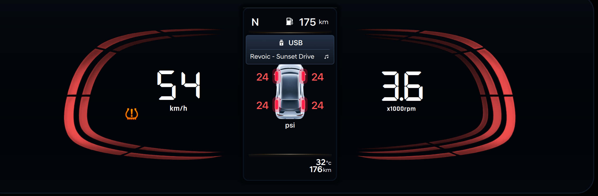
</p>

- Top-Line Emergence: The media banner glides out smoothly directly from inside the top white TFT divider line (520ms entrance with OutCubic easing) rather than dropping from outside the housing.
- 5-Second Auto-Dismiss: Stays visible for 5 seconds upon starting or switching tracks, then glides back up into the top line.
- Every-Song Re-Triggering: Switching songs always re-triggers the slide-out entrance and resets the text position to start.
- Marquee Text Scrolling:
  - Short track titles stay centered.
  - Long song and artist titles hold for 1.2 seconds at the start, glide smoothly horizontally to reveal the full title, hold for 1.2 seconds at the end, and glide back in a continuous loop.
- Official OEM Source Icons:
  - USB: Authentic USB drive with metal connector and engraved USB trident.
  - Apple CarPlay: Official Apple CarPlay dashboard touchscreen with dock and app grid.
  - Bluetooth Audio: Official high-definition Bluetooth symbol.
  - Android Auto: Official Android Auto chevron arrow.
  - FM Radio: Radio broadcast icon.

---

### 2. Full 4-Wheel Interactive TPMS Control Station

<p align="center">
  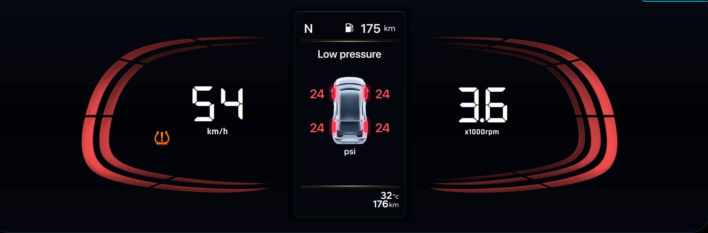
</p>

- 2x2 Interactive Wheel Grid in ECU Simulator:
  - Dedicated cards for Front-Left (FL), Front-Right (FR), Rear-Left (RL), and Rear-Right (RR) tyres.
  - Live Status Readout: Color-coded in Green (OK >= 32 PSI), Yellow/Amber (Low 26-31 PSI), and Red (Flat/Puncture < 26 PSI).
  - Steppers: Fine-tune each tyre pressure in 1 PSI increments.
  - Quick One-Touch Presets: Low 24, Flat 16, and OK 35 per tyre.
- Master Calibration & Unit Switcher:
  - Calibrated vs Drive to Display modes.
  - Live unit conversion between psi, kPa, and bar across cluster and simulator.
- Center Vehicle Diagram Reaction: Under-inflated tyres pulse with authentic amber/red glowing pills, triggering the cluster TPMS telltale and amber TFT accent lines.

---

### 3. Standby Ignition-OFF Mode with Door-Wake Reactivity

<p align="center">
  
</p>

- State 5 (Ignition OFF / Standby):
  - When all doors are closed, the entire instrument cluster is 100% pitch black (total dark, zero dials, zero background glow).
- Door-Wake Reactivity:
  - Opening any door, bonnet, or trunk instantly wakes the central TFT display.
  - Displays pure crisp white curved top and bottom divider lines, the large centered vehicle animation showing open door swings and blinking red hazard hoods, and ONLY the Odometer at the bottom right (temperature, gear, and DTE headers remain hidden).
  - Closing all doors smoothly fades the cluster back to 100% total darkness.

---

### 4. Pixel-Locked Zero-Movement Car Door Animation & Hazard Glows

<p align="center">
  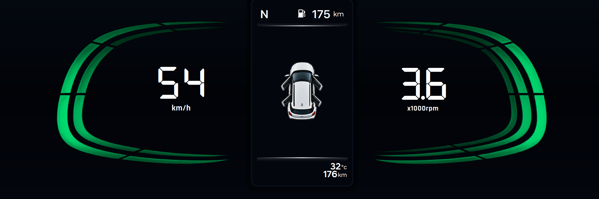
</p>

- Zero-Drift Pixel Lock: All 19 car door animation frames are mathematically normalized against the base chassis (0.000 pixel drift). When doors open or close, the chassis, roof, windshield, and wheels remain completely motionless — only the door flaps physically swing outward.
- Contoured Bonnet & Trunk Hazards: Photorealistic red hazard glow overlays following the exact vehicle body stamping lines, pulsing at a 400ms cadence.

---

### 5. Regional Multi-Language Localization (English & Hindi)

<p align="center">
  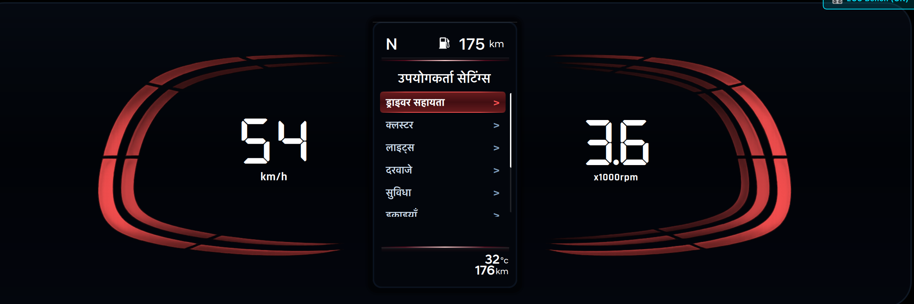
</p>

- Real-Time Language Switching: Seamlessly toggle between English and Hindi (हिन्दी) through the User Settings menu (`Settings -> Language -> English / हिन्दी`).
- Full Vernacular Localization: All primary categories, submenus, vehicle diagnostics, prompts, and settings translated into authentic OEM Hindi terminology:
  - चालक सहायता (Driver assistance)
  - क्लस्टर (Cluster)
  - लाइट्स (Lights)
  - डोर (Door)
  - सुविधा (Convenience)
  - यूनिट सेटिंग (Unit setting)
  - भाषा (Language)
  - सेटिंग्स रीसेट करें (Reset settings)
- Responsive Devnagari Typography: Integrated with clean Unicode line spacing and dynamic centering across all TFT views.

---

### 6. Autonomous Dynamic Driving Simulation Engine & OEM Telltales

<p align="center">
  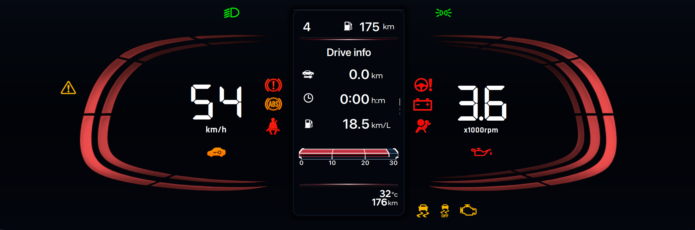
</p>

- Multi-Phase Driving Cycle (approx. 60 seconds realistic highway/city loop):
  - Phase 1: City Start & Acceleration (0 to 45 km/h) with automatic gear shifting D1 to D2 to D3.
  - Phase 2: Left Lane Change with automatic Left Turn Signal (3s flashing).
  - Phase 3: Highway Ramp Acceleration (55 to 105 km/h) through D4 to D5 with matching RPM powerband curves.
  - Phase 4: Highway Cruise Control locked at 100 km/h with green CRUISE telltale.
  - Phase 5: Right Lane Exit with automatic Right Turn Signal (3s flashing).
  - Phase 6: Deceleration / Coasting (80 to 0 km/h) with instant fuel economy maxing out at 30 km/L.
  - Phase 7: Traffic Light Idle at 0 km/h with idle RPM (0.8 x1000 RPM).
- Realigned OEM Telltales: Master Warning on Far-Left and Bulb Fault on Bottom-Left matching physical cluster blueprints.

---

## Core Cluster Architecture & Foundational Features

### 1. Dual Digital Dial Gauges (Speedometer & Tachometer)
- **Speedometer**: Custom-styled 7-segment digital speed readout (`0–180 km/h`) flanked by authentic segmented speed arc lines.
- **Tachometer (RPM)**: Precision x1000 RPM digital gauge with realistic torque curve & shift points.
- **AMT Transmission**: Automatic gear indicators (`P`, `R`, `N`, `D`, `1–5`) and manual sequential shift modes (`M1–M5`).

### 2. Central 4.2-inch TFT Multi-Function Display (MFD)
- **Top Header Status**: Active gear, dynamic fuel range (DTE km), ambient temperature (`32°C`), and total odometer.
- **Rising Spotlight Tab Bar**: 3 category tabs (`Trip / Car`, `User Settings / Cog`, `TPMS / Info`) with theme-colored spotlight flare emerging from the curved divider line.
- **Non-Touch Automotive Interaction**: Fully operated via steering wheel switches (`▲ UP`, `▼ DOWN`, `OK`, `↩ BACK`, `INFO`) or keyboard shortcuts.

### 3. Trip Computer & 3D ECO Gauge
- **3-Page Trip Computer**:
  - `Drive Info` (Distance km, Elapsed driving time, Average fuel economy km/L)
  - `Since Refuelling`
  - `Accumulated Info`
- **Instant ECO Gauge**: 3D extruded curved gauge with dynamic volumetric blue/green/red glow.

### 4. Comprehensive User Settings System
- Multi-level hierarchical menu with smooth viewport auto-centering:
  - **Driver assistance**: Warning methods, Warning volume (`High`, `Medium`, `Low`).
  - **Cluster**: Theme selection (`Cyan`, `Emerald`, `Crimson`) + interactive toggles (`Wiper/Lights display`, `Icy road warning`, `Welcome sound`).
  - **Lights**: Illumination 3D convex glass arc gauge with steppers, One-touch turn indicator (`7`, `5`, `3 flashes`, `Off`), Headlight time-out.
  - **Door**: Auto Lock (`On Speed` / `Off`), Auto Unlock (`On Key Out` / `Off`).
  - **Convenience**: Rear Occupant Alert, Service Interval (`10,000 km`).
  - **Unit setting**: Fuel Economy (`km/L`), Temperature (`°C`), Tyre Pressure (`psi`, `kPa`, `bar`).
  - **Language**: English and Hindi (`हिन्दी`) full localization.
  - **Reset settings**: Factory reset confirmation dialog.

### 5. TPMS Tyre Pressure Monitoring System
- **Transparent 3D Top-Down Car Graphic**: High-resolution top-down car silhouette.
- **"Drive to display" State**: Overlay card shown when starting/stationary until driven for 5 seconds.
- **4-Corner Live PSI Readout**: Front-Left, Front-Right, Rear-Left, Rear-Right pressure digits + centered `psi` label.
- **Dynamic Warning Glow**:
  - Normal (`≥ 32 PSI`): Crisp white numbers.
  - Low (`26–31 PSI`): Title changes to `"Low pressure"`, affected tyre pulses with an amber glow pill & aura.
  - Critical (`< 26 PSI`): Pulsing red tyre glow and red digit with cluster TPMS warning telltale.

### 6. Dynamic Multi-Theme Engine
- **Theme A (Electric Cyan)**: Cobalt blue selection capsule with electric cyan neon accents (`#00E5FF`).
- **Theme B (Emerald Green)**: Emerald forest gradient with neon green edges (`#00E676`).
- **Theme C (Crimson Red)**: Crimson ruby gradient with coral red edges (`#FF5252`).
- *Live color reactivity across all dials, 3D illumination arc, dividers, checkboxes, and radio buttons.*

---

## Feature Gallery

<p align="center">
  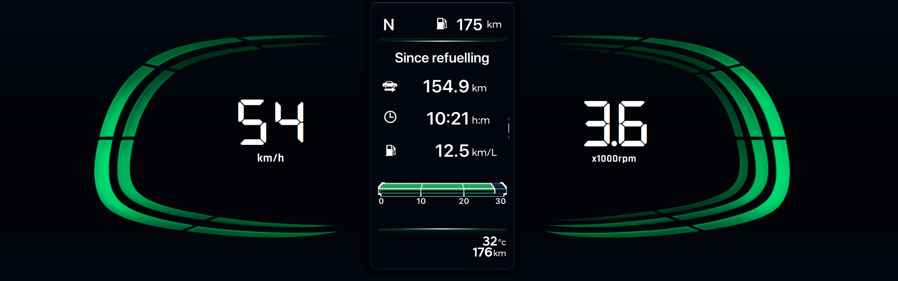
  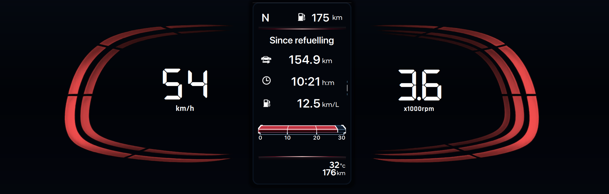
</p>

<p align="center">
  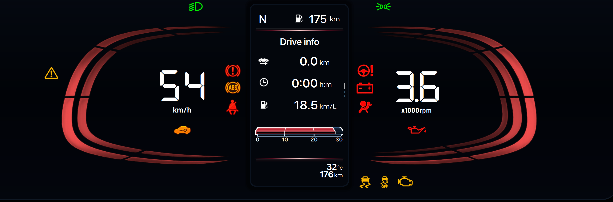
  
</p>

<p align="center">
  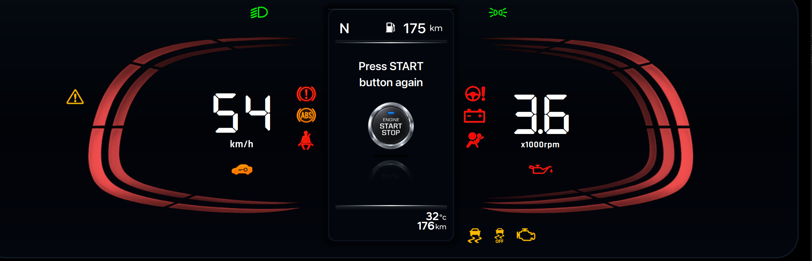
  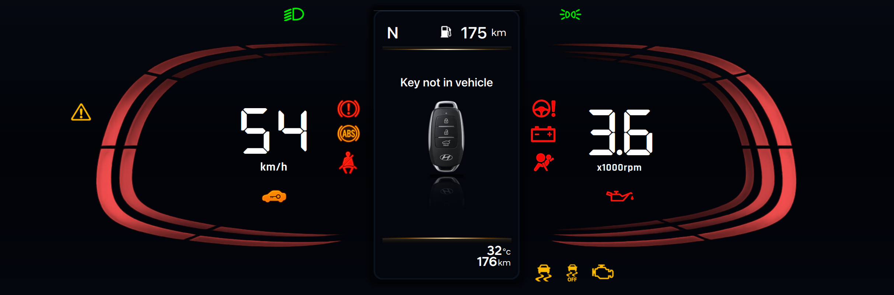
</p>

<p align="center">
  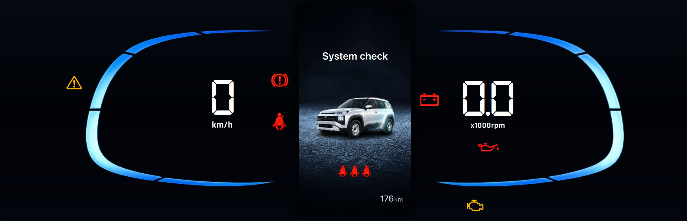
  
</p>

---

## System Architecture (PlantUML Component Architecture)

```mermaid
flowchart TB
    classDef controller fill:#1E293B,stroke:#38BDF8,stroke-width:2px,color:#F8FAFC;
    classDef qmlCenter fill:#0F172A,stroke:#00E5FF,stroke-width:1.5px,color:#F8FAFC;
    classDef qmlGauge fill:#0F172A,stroke:#64748B,stroke-width:1.5px,color:#F8FAFC;
    classDef ecuBench fill:#0F291E,stroke:#00E676,stroke-width:1.5px,color:#F8FAFC;
    classDef audioEngine fill:#2A122E,stroke:#E879F9,stroke-width:1.5px,color:#F8FAFC;

    subgraph PKG_CORE [package: Core C++ Architecture]
        MAIN["&laquo;executable&raquo;<br><b>main.cpp</b><br>QGuiApplication &amp; QQmlEngine"]:::controller
        CTRL["&laquo;QObject Singleton&raquo;<br><b>ClusterController</b><br>CAN / ECU Telemetry Gateway<br>AMT Shift Engine | Trip Accumulators<br>Standby Power State &amp; Door Wake"]:::controller
    end

    subgraph PKG_CENTRAL_TFT [package: Central 4.2-inch TFT MFD]
        CENTER["&laquo;QML Viewport&raquo;<br><b>CenterTripDisplay.qml</b><br>Trip Pages | Range DTE | ODO | Temp<br>Green 'N' Gear | Rear Seatbelt Grid"]:::qmlCenter
        MEDIA["&laquo;Inside-Line Viewport&raquo;<br><b>Sliding Infotainment Banner</b><br>Live 4-Bar Audio Spectrum EQ<br>Apple CarPlay | BT | USB | Android"]:::qmlCenter
        TPMS["&laquo;QML View&raquo;<br><b>TpmsDisplayView.qml</b><br>3D Chassis Graphic | 4-Wheel PSI"]:::qmlCenter
        SETTINGS["&laquo;QML View&raquo;<br><b>UserSettingsView.qml</b><br>8 OEM Menus | Hindi Localization"]:::qmlCenter
        ECO["&laquo;QML View&raquo;<br><b>InstantEcoGauge.qml</b><br>3D Extruded Fuel Economy Gauge"]:::qmlCenter
        STARTUP["&laquo;QML Sequence&raquo;<br><b>StartupAnimationView.qml</b><br>APEX Laser Brand Reveal"]:::qmlCenter
        CHECK["&laquo;QML Sequence&raquo;<br><b>VehicleCheckView.qml</b><br>5.0s Diagnostic Bulb Check Sweep"]:::qmlCenter
        GOODBYE["&laquo;QML Sequence&raquo;<br><b>GoodbyeView.qml</b><br>Trip Summary &amp; Shutdown"]:::qmlCenter
    end

    subgraph PKG_GAUGES [package: Digital Gauges &amp; Cluster Frame]
        FRAME["&laquo;QML Bezel&raquo;<br><b>BlueFrame.qml &amp; ClusterUnit.qml</b><br>Speed Arc Lines | 1:1 OEM Telltales"]:::qmlGauge
        SPEED["&laquo;7-Segment&raquo;<br><b>SpeedDisplay.qml</b><br>0-180 km/h Digital Speed"]:::qmlGauge
        RPM["&laquo;7-Segment&raquo;<br><b>RpmDisplay.qml</b><br>AMT Engine RPM &amp; Torque Band"]:::qmlGauge
        GEAR["&laquo;Display Logic&raquo;<br><b>Dual Gear Indicators</b><br>Green 'N' (#00E676) | White PRD"]:::qmlGauge
        FLUID["&laquo;Custom Gauges&raquo;<br><b>FuelGauge.qml &amp; TempGauge.qml</b><br>12-Segment Fuel &amp; Coolant Bars"]:::qmlGauge
    end

    subgraph PKG_AUDIO [package: Symphonic Audio &amp; Chimes Suite]
        AUDIO_BUS["&laquo;Audio Channel Bus&raquo;<br><b>QSoundEffect &amp; QMediaPlayer</b>"]:::audioEngine
        CH1["&laquo;chime&raquo; Welcome Melody (2.35s)"]:::audioEngine
        CH2["&laquo;chime&raquo; Diagnostic Self-Test Chord (5.0s)"]:::audioEngine
        CH3["&laquo;chime&raquo; Goodbye Melody (3.24s)"]:::audioEngine
        CH4["&laquo;chime&raquo; Luxury European Warning Gong"]:::audioEngine
        CH5["&laquo;chime&raquo; AIS-145 Belt Beep Reminder"]:::audioEngine
    end

    subgraph PKG_ECU [package: High-Density ECU Diagnostic Bench]
        ECU_BENCH["&laquo;CANoe Testbench&raquo;<br><b>EcuSimulatorPanel.qml</b><br>Compact 215px High-Density Cards<br>Hardware Micro-LED Status Dots (Zero Emojis)"]:::ecuBench
        S1["<b>SYS-01:</b> Powertrain &amp; Speed Sweeps"]:::ecuBench
        S2["<b>SYS-02:</b> Transmission &amp; AMT Gearbox"]:::ecuBench
        S3["<b>SYS-03:</b> Steering D-Pad &amp; Trip Reset"]:::ecuBench
        S4["<b>SYS-04:</b> Chassis, TPMS &amp; EPS MIL"]:::ecuBench
        S5["<b>SYS-05:</b> Doors, Hood, Trunk &amp; Roof"]:::ecuBench
        S6["<b>SYS-06:</b> AIS-145 Occupant Restraints"]:::ecuBench
        S7["<b>SYS-07:</b> Infotainment &amp; Key Fob Alert"]:::ecuBench
    end

    MAIN -->|instantiates| CTRL
    CTRL -->|Q_PROPERTY bindings| CENTER
    CTRL -->|telemetry data| SPEED
    CTRL -->|telemetry data| RPM
    CTRL -->|gear state| GEAR
    CTRL -->|fluid levels| FLUID
    CTRL -->|telltale states| FRAME
    CTRL -->|trigger audio events| AUDIO_BUS
    CTRL <-->|bidirectional CAN bus| ECU_BENCH

    CENTER --> MEDIA
    CENTER --> TPMS
    CENTER --> SETTINGS
    CENTER --> ECO
    CENTER --> STARTUP
    CENTER --> CHECK
    CENTER --> GOODBYE

    AUDIO_BUS --> CH1
    AUDIO_BUS --> CH2
    AUDIO_BUS --> CH3
    AUDIO_BUS --> CH4
    AUDIO_BUS --> CH5

    ECU_BENCH --> S1
    ECU_BENCH --> S2
    ECU_BENCH --> S3
    ECU_BENCH --> S4
    ECU_BENCH --> S5
    ECU_BENCH --> S6
    ECU_BENCH --> S7
```

<details>
<summary><b>📄 View Native PlantUML Component Specification (.puml)</b></summary>

```plantuml
@startuml
!theme plain
skinparam backgroundColor #0D1117
skinparam defaultFontColor #E6EDF3
skinparam defaultFontName "Segoe UI"
skinparam roundCorner 10
skinparam packageBackgroundColor #161B22
skinparam packageBorderColor #30363D
skinparam componentBackgroundColor #21262D
skinparam componentBorderColor #58A6FF
skinparam componentFontColor #FFFFFF
skinparam interfaceBackgroundColor #00E5FF
skinparam interfaceBorderColor #00E5FF
skinparam arrowColor #58A6FF
skinparam arrowThickness 1.5

title APEX Horizon AMT — Digital Instrument Cluster HMI Architecture

package "Core Engine (C++20 / Qt 6)" {
    [main.cpp] as MAIN <<executable>>
    [ClusterController] as CTRL <<QObject Singleton>>
    MAIN --> CTRL : instantiates
}

package "Central 4.2-inch TFT MFD" {
    [CenterTripDisplay.qml] as CENTER <<QML Viewport>>
    [Sliding Infotainment Banner] as MEDIA <<Sliding Viewport>>
    [TpmsDisplayView.qml] as TPMS <<QML View>>
    [UserSettingsView.qml] as SETTINGS <<QML View>>
    [InstantEcoGauge.qml] as ECO <<QML Gauge>>
    [StartupAnimationView.qml] as STARTUP <<QML Sequence>>
    [VehicleCheckView.qml] as CHECK <<QML Sequence>>
    [GoodbyeView.qml] as GOODBYE <<QML Sequence>>

    CENTER *-- MEDIA
    CENTER *-- TPMS
    CENTER *-- SETTINGS
    CENTER *-- ECO
    CENTER *-- STARTUP
    CENTER *-- CHECK
    CENTER *-- GOODBYE
}

package "Digital Gauges & Cluster Frame" {
    [SpeedDisplay.qml] as SPEED <<7-Segment>>
    [RpmDisplay.qml] as RPM <<7-Segment>>
    [Dual Gear Indicators] as GEAR <<Green N / White PRD>>
    [Fuel & Temp Gauges] as FLUIDS <<12-Segment Bars>>
    [BlueFrame.qml & ClusterUnit.qml] as FRAME <<Bezel & Telltales>>
}

package "Symphonic Audio & Chimes Suite" {
    [ClusterUnit Audio Engine] as AUDIO <<Channel Bus>>
    interface "Welcome Melody (2.35s)" as CH1
    interface "Diagnostic Self-Test (5.0s)" as CH2
    interface "Goodbye Melody (3.24s)" as CH3
    interface "Warning Gong" as CH4
    interface "AIS-145 Belt Beep" as CH5

    AUDIO ..> CH1
    AUDIO ..> CH2
    AUDIO ..> CH3
    AUDIO ..> CH4
    AUDIO ..> CH5
}

package "High-Density ECU Diagnostic Bench" {
    [EcuSimulatorPanel.qml] as ECU <<CANoe Testbench>>
    [SYS-01: Powertrain & Speed Sweeps] as S1
    [SYS-02: Transmission & AMT Gearbox] as S2
    [SYS-03: Steering D-Pad & Trip HMI] as S3
    [SYS-04: Chassis, TPMS & EPS MIL] as S4
    [SYS-05: Access, Doors & Closures] as S5
    [SYS-06: AIS-145 Restraints Matrix] as S6
    [SYS-07: Infotainment & Key Fob Alert] as S7

    ECU *-- S1
    ECU *-- S2
    ECU *-- S3
    ECU *-- S4
    ECU *-- S5
    ECU *-- S6
    ECU *-- S7
}

CTRL --> CENTER : Q_PROPERTY & Signals
CTRL --> SPEED : Speed Telemetry
CTRL --> RPM : AMT RPM Curves
CTRL --> GEAR : Gear Selection (Green N)
CTRL --> FLUIDS : Fuel & Coolant Levels
CTRL --> FRAME : 1:1 OEM Telltale States
CTRL --> AUDIO : Chime Event Triggers
CTRL <--> ECU : Bidirectional CAN Bus

@enduml
```
</details>


---

## Controls & Steering Wheel Switches

You can operate the cluster using either the ECU Simulator Bench ([F12] or [Tab]) or keyboard shortcuts:

| Steering Switch | Keyboard Key | Action |
| :--- | :--- | :--- |
| INFO / TAB | [ I ] | Cycle between Trip Computer, User Settings, and TPMS tabs |
| UP | [ Up Arrow ] | Scroll up / Previous trip page / Brightness increment |
| DOWN | [ Down Arrow ] | Scroll down / Next trip page / Brightness decrement |
| OK | [ Enter ] / [ Return ] | Enter submenu / Toggle checkbox / Select option |
| BACK | [ Esc ] / [ Backspace ] | Return to previous parent menu |
| THROTTLE | [ Right Arrow ] / [ Left Arrow ] | Accelerate / Decelerate speed and RPM |
| PARK BRAKE | [ B ] | Toggle Handbrake telltale |
| AUTO DRIVE | [ A ] | Start/Stop autonomous driving simulation |
| IGNITION | [ O ] | Toggle Ignition ON / OFF standby mode |
| SIMULATOR | [ F12 ] / [ Tab ] | Open/Close ECU Simulator Bench panel |

---

## Build & Run Instructions

### Prerequisites
- Qt 6.5+ (Qt Quick, QML, Core, Gui, Multimedia, Svg)
- CMake 3.20+
- C++20 compatible compiler (Clang / GCC / MSVC)
- Ninja or Make

### Quick Start
```bash
# Clone the repository
git clone https://github.com/skrehanahamed/Apex_MidEnd_Cluster.git
cd Apex_MidEnd_Cluster

# Configure and build
mkdir build && cd build
cmake .. -GNinja
ninja

# Run the cluster application
./APEXHorizonClusterApp
```

Or using the built-in Makefile:
```bash
make run
```

---

## Project Structure

```text
Apex_MidEnd_Cluster/
├── CMakeLists.txt              # CMake build configuration and QML type registration
├── Makefile                    # Helper make targets (run, build, clean)
├── README.md                   # Complete project documentation
├── assets/
│   ├── cluster_preview.png     # Full digital cluster overview screenshot
│   ├── horizon_car.png         # OEM Horizon silhouette for TFT center display
│   ├── oem_studio_ground.png   # Studio ground plane for car render
│   ├── car_ground_shadow.png   # Ground shadow overlay
│   ├── rpm_line1-5.svg         # Right gauge concentric arc line SVGs
│   ├── speed_line1-5.svg       # Left gauge concentric arc line SVGs
│   └── features/               # Feature screenshots and component illustrations
├── src/
│   ├── main.cpp                # Application entry point & QML engine initialization
│   ├── ClusterController.h     # C++ controller header (AMT, Trip, Media, TPMS, Power, Themes)
│   └── ClusterController.cpp   # Simulation engine: AMT powertrain, trip accumulators,
│                               #   demo drive loop, instant economy, chime triggers
├── qml/
│   ├── Main.qml                # Root application window & global keyboard handlers
│   ├── ClusterUnit.qml         # Master cluster frame, state machine, gauge layout
│   ├── center/
│   │   ├── CenterTripDisplay.qml    # Central TFT: trip pages, DTE, ODO, gear, temp, media
│   │   ├── InstantEcoGauge.qml      # 3D curved instant fuel economy gauge
│   │   ├── UserSettingsView.qml     # OEM User Settings: subpages, Hindi localization
│   │   ├── TpmsDisplayView.qml      # 3D top-down TPMS screen with tyre warning glow
│   │   ├── StartupAnimationView.qml # Welcome animation: 5-line arc & laser convergence
│   │   ├── VehicleCheckView.qml     # Startup self-diagnostic bulb check sweep
│   │   └── GoodbyeView.qml          # Ignition-off trip summary & shutdown sequence
│   ├── gauges/
│   │   ├── SpeedDisplay.qml         # 7-segment digital speed readout & arc bars
│   │   ├── RpmDisplay.qml           # 7-segment AMT RPM readout & torque curve
│   │   ├── FuelGauge.qml            # Custom OEM-style horizontal fuel bar gauge
│   │   ├── FuelIcon.qml             # Fuel pump icon with low-fuel warning state
│   │   ├── TempGauge.qml            # Custom OEM-style horizontal coolant temp bar
│   │   ├── TempIcon.qml             # Coolant thermometer icon with overheat warning
│   │   └── SevenSegmentDigit.qml    # Reusable 7-segment display digit component
│   ├── frame/
│   │   └── BlueFrame.qml            # Outer bezel, speed-driven arc lines, glow frame
│   └── simulator/
│       └── EcuSimulatorPanel.qml    # ECU test bench: media, TPMS, AMT auto-drive card,
│                                    #   smart key, doors, telltales, light stalk
└── resources/
    ├── fonts/
    │   ├── ClusterSansHead-Regular.ttf   # Cluster Sans Head Regular
    │   ├── ClusterSansHead-Medium.ttf    # Cluster Sans Head Medium weight
    │   ├── ClusterSansHead-Bold.ttf      # Cluster Sans Head Bold weight
    │   ├── NotoSansDevanagari-Regular.ttf # Hindi localization typeface
    │   ├── DSEG7Classic-Bold.ttf         # 7-segment display font
    │   ├── DSEG7Classic-Regular.ttf      # 7-segment display font (regular)
    │   ├── Orbitron-Bold.ttf             # Futuristic HUD accent font
    │   └── Rajdhani-Bold.ttf             # Automotive display accent font
    ├── icons/
    │   ├── (OEM telltale PNGs)           # abs, airbag, battery, brake, engine_mil,
    │   │                                 #   esc, high_beam, low_beam, master_warning,
    │   │                                 #   oil, seatbelt, steering, tpms, etc.
    │   ├── (Media source icons)          # media_usb, media_carplay, media_bluetooth,
    │   │                                 #   media_android_auto, media_note
    │   ├── (Gauge icons)                 # fuel_meter_icon, temp_meter_icon,
    │   │                                 #   low_fuel_warning_3d, fuel_pump
    │   ├── (Car door animation frames)   # car_door_fl/fr/rl/rr + half variants,
    │   │                                 #   car_doors_all_open, bonnet/trunk glow,
    │   │                                 #   horizon_3d_car, horizon_3d_door_layer
    │   ├── (TPMS)                        # tpms_car_top, tpms
    │   ├── (Trip computer)               # trip_car, trip_clock, trip_fuel
    │   ├── (Smart Key)                   # smart_key, smart_key_fob,
    │   │                                 #   engine_start_button_oem
    │   └── (Cruise control)              # cruise_green, cruise_white
    └── audio/
        ├── tick.wav                      # Turn signal tick (left / right)
        ├── tock.wav                      # Turn signal tock (left / right)
        ├── welcome_chime.wav             # Ascending automotive welcome melody
        ├── startup_animation_tone.wav    # Multi-voice symphonic system check chord
        ├── goodbye_chime.wav             # Descending farewell departure melody
        ├── key_alert_chime.wav           # Smart key not detected alert
        ├── seatbelt_chime.wav            # Automotive seatbelt reminder beep
        ├── speed_alert_chime.wav         # Overspeed warning chime
        └── warning_chime.wav             # Luxury automotive dual-tone warning gong
```

---

## License
This project is licensed under the MIT License. Created for automotive HMI software engineering, portfolio, and demonstration purposes.

---

<p align="center">
  Made with ❤️ by <b>Rehan</b> &amp; <b>AI (Gemini &amp; ChatGPT)</b>
</p>

