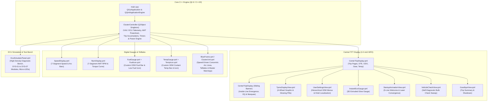

# APEX Horizon AMT — Automotive Digital Instrument Cluster & Cockpit HMI

<p align="center">
  
</p>

<p align="center">
  
  
  
  
  
  
  
</p>

A production-grade, photorealistic Automotive Digital Instrument Cluster HMI for the **APEX Horizon AMT** (Smart Auto), engineered using **Qt 6 (QML / Qt Quick)** and modern **C++20**. Features authentic automotive typography, 1:1 OEM telltale layouts, dynamic multi-page trip computing, full 4-wheel TPMS telemetry, an autonomous driving simulation engine, standby power management with door-wake reactivity, an edge-to-edge sliding infotainment media bridge, and an aerospace-grade CANoe-style ECU diagnostic test bench.

---

## Release Notes — Version 2.2.0 (September 2026)

### 1. Edge-to-Edge Inside-Line Sliding Infotainment Banner
- **Full-Width Horizon Viewport**: Replaced the narrow floating card with a full-width header banner spanning the entire center TFT display edge-to-edge.
- **Inside-Line Emergence & Retraction**: Emerges smoothly from *inside* the upper TFT dividing line (`Easing.OutCubic`, 420ms) upon track change or source selection, and retracts back inside the upper line (`Easing.InOutCubic`, 350ms) after a 5-second hold.
- **Live 4-Bar Audio Spectrum Visualizer**: Dynamic audio equalizer bars animate in real time alongside playback status.
- **Continuous Marquee Typography**: Auto-scrolls long track and artist names with hold-at-edge smoothing.
- **Authentic Transparent Apple CarPlay Emblem**: Rendered with authentic Apple green gradient badge and crisp white display mark on a 100% alpha transparent canvas, alongside official Bluetooth Audio, USB Media, Android Auto, and FM Radio sources.

### 2. High-Density Compact ECU Diagnostic Test Bench
- **Space-Efficient Ergonomic Footprint**: Compact 215px card height with 20–24px precision buttons and slim sliders, fitting cleanly into smaller desktop windows without excessive scrolling.
- **Elimination of Raw Consumer Emojis**: Replaced all basic Unicode emojis with hardware-grade glowing micro-LEDs (`#00E676` emerald, `#FF3D57` red, `#00E5FF` cyan, `#FFA000` amber) and a pulsing top test bench status heartbeat.
- **Tactile Interactive Micro-Feedback**: Every control features smooth scale-down press animations (`scale: pressed ? 0.96 : 1.0`) and subtle hover border glows.
- **Subsystem Engineering Categorization**:
  - `SYS-01: Powertrain & Engine` (Cluster state machine, live speed/RPM sliders, quick speed sweeps: 0, 40, 80, 120 km/h, autonomous drive demo).
  - `SYS-02: Transmission & AMT Gearbox` (PRND selector, D1..D5 and M1..M5 ratios, fluid sliders, cruise control bar).
  - `SYS-03: Steering D-Pad & Trip HMI` (Steering wheel physical D-Pad cluster, trip sub-pages, trip reset).
  - `SYS-04: Chassis, Braking & TPMS` (Electric parking brake toggle, individual FL/FR/RL/RR tyre PSI readouts, puncture simulation, EPS power steering fault trigger).
  - `SYS-05: Access & Body Closures` (4-door ajar matrix, hood, trunk, sunroof alert, bulk secure/ajar presets).
  - `SYS-06: Occupant Restraints` (Driver seatbelt, 3-point rear passenger occupancy matrix with silent buckle preset).
  - `SYS-07: Infotainment & Connectivity` (Media source selection, transport controls, smart key fob presence, driver attention alert).

### 3. Automotive Green Neutral Gear ("N")
- **Dedicated Distinctive Neutral Display**: When the transmission is in `"N"` (Neutral), the gear text illuminates in vivid automotive green (`#00E676`) on both the top cruise gear indicator and the central transmission block. All other gears (P, R, D, D1..D5, M1..M5) remain pure crisp white (`#FFFFFF`).

### 4. AIS-145 3-Point Rear Seatbelt Occupant Grid & Standard Beeping
- **3-Seat Occupant Sensor Matrix**: Dedicated sensors for Rear-Left (RL), Rear-Center (RC), and Rear-Right (RR).
- **Automotive Standard Chime**: Rear seatbelt unbuckling triggers strictly the standard automotive seatbelt reminder beeping chime (`seatbelt_chime.wav`), never sounding the warning gong.

### 5. Multi-Voice Symphonic Automotive Chimes Suite
- **Welcome Melody**: Ascending automotive welcome chord sequence (2.35s).
- **Diagnostic System Check**: Multi-voice symphonic cluster chord (440 Hz, 550 Hz, 660 Hz) sustaining the full 5.0-second diagnostic self-test.
- **Goodbye Melody**: Descending farewell departure chord (3.24s).
- **Warning Gong**: Luxury European automotive dual-tone gong (370 Hz &rarr; 440 Hz).

### 6. High-Definition Smart Key Fob Visual Alert Engine
- High-resolution key fob graphic with "Key Not In Vehicle" prompt and audio alert.

---

## Feature Gallery

<p align="center">
  
</p>

<p align="center">
  
</p>

<p align="center">
  
  
</p>

<p align="center">
  
  
</p>

<p align="center">
  
  
</p>

<p align="center">
  
  
</p>

---

## System Architecture



---

## Controls & Steering Wheel Switches

You can operate the cluster using either the ECU Simulator Test Bench or physical keyboard shortcuts:

| Steering Switch | Keyboard Key | Action |
| :--- | :--- | :--- |
| **INFO / TAB** | `[ I ]` | Cycle between Trip Computer, User Settings, and TPMS tabs |
| **UP** | `[ Up Arrow ]` | Scroll up / Previous trip page / Menu navigation |
| **DOWN** | `[ Down Arrow ]` | Scroll down / Next trip page / Menu navigation |
| **OK / SELECT** | `[ Enter ]` / `[ Return ]` | Enter submenu / Toggle setting / Hold to reset trip |
| **BACK** | `[ Esc ]` / `[ Backspace ]` | Return to previous parent menu |
| **THROTTLE** | `[ Right Arrow ]` / `[ Left Arrow ]` | Accelerate / Decelerate vehicle speed and AMT RPM |
| **PARK BRAKE** | `[ B ]` | Toggle Electronic Parking Brake telltale |
| **GEAR SELECT** | `[ P ]`, `[ R ]`, `[ N ]`, `[ D ]` | Select Transmission Gear directly |
| **MANUAL GEARS**| `[ 1 ]` to `[ 5 ]` | Select Manual Tiptronic ratios M1 through M5 |
| **CYCLE GEAR**  | `[ G ]` / `[ M ]` | Cycle sequential transmission gears |
| **AUTO DRIVE**  | `[ A ]` | Start / Stop autonomous driving simulation |
| **IGNITION**    | `[ Space ]` | Trigger Boot Sequence / Toggle Ignition Power |

---

## Build & Run Instructions

### Prerequisites
- **Qt 6.5+** (Qt Quick, QuickControls2, Qml, Core, Gui, Multimedia, Svg)
- **CMake 3.20+**
- **C++20** compatible compiler (Clang / GCC / MSVC)
- **Ninja** or **Make**

### Quick Start
```bash
# Clone the repository
git clone https://github.com/skrehanahamed/horizon-cluster.git
cd horizon-cluster

# Configure and build
mkdir build && cd build
cmake .. -GNinja
ninja

# Run the cluster application
./ApexClusterApp
```

Or using the built-in Makefile:
```bash
make run
```

---

## Project Structure

```text
Apex_MidEnd_Cluster/
├── CMakeLists.txt              # CMake build configuration and QML module registration
├── Makefile                    # Helper make targets (run, build, clean)
├── README.md                   # Complete project documentation
├── assets/
│   ├── cluster_preview.png     # Digital cluster overview screenshot
│   ├── apex_logo.png           # APEX vector branding badge
│   ├── apex_wordmark.png       # APEX automotive wordmark
│   ├── horizon_car.png         # APEX Horizon silhouette for TFT center display
│   ├── oem_studio_ground.png   # Studio ground plane for car render
│   ├── car_ground_shadow.png   # Ground shadow overlay
│   ├── rpm_line1-5.svg         # Right gauge concentric arc line SVGs
│   ├── speed_line1-5.svg       # Left gauge concentric arc line SVGs
│   └── features/               # Feature screenshots and component illustrations
├── src/
│   ├── main.cpp                # Application entry point & QML engine initialization
│   ├── ClusterController.h     # C++ controller header (AMT, Trip, Media, TPMS, Power, Themes)
│   └── ClusterController.cpp   # Simulation engine: AMT powertrain, trip accumulators,
│                               #   demo drive loop, instant economy, chime triggers
├── qml/
│   ├── Main.qml                # Root application window & global keyboard handlers
│   ├── ClusterUnit.qml         # Master cluster frame, state machine, gauge layout
│   ├── center/
│   │   ├── CenterTripDisplay.qml    # Central TFT: trip pages, DTE, ODO, gear, temp, sliding media
│   │   ├── InstantEcoGauge.qml      # 3D curved instant fuel economy gauge
│   │   ├── UserSettingsView.qml     # OEM User Settings: subpages, Hindi localization
│   │   ├── TpmsDisplayView.qml      # 3D top-down TPMS screen with tyre warning glow
│   │   ├── StartupAnimationView.qml # Welcome animation: 5-line arc & laser convergence
│   │   ├── VehicleCheckView.qml     # Startup self-diagnostic bulb check sweep
│   │   └── GoodbyeView.qml          # Ignition-off trip summary & shutdown sequence
│   ├── gauges/
│   │   ├── SpeedDisplay.qml         # 7-segment digital speed readout & arc bars
│   │   ├── RpmDisplay.qml           # 7-segment AMT RPM readout & torque curve
│   │   ├── FuelGauge.qml            # Custom OEM-style horizontal fuel bar gauge
│   │   ├── FuelIcon.qml             # Fuel pump icon with low-fuel warning state
│   │   ├── TempGauge.qml            # Custom OEM-style horizontal coolant temp bar
│   │   ├── TempIcon.qml             # Coolant thermometer icon with overheat warning
│   │   └── SevenSegmentDigit.qml    # Reusable 7-segment display digit component
│   ├── frame/
│   │   └── BlueFrame.qml            # Outer bezel, speed-driven arc lines, glow frame
│   └── simulator/
│       └── EcuSimulatorPanel.qml    # ECU test bench: SYS-01 to SYS-07 high-density modules,
│                                    #   micro-LED status indicators, quick sweeps
└── resources/
    ├── fonts/
    │   ├── ClusterSansHead-Regular.ttf   # Cluster Sans Head (patched name table)
    │   ├── ClusterSansHead-Medium.ttf    # Cluster Sans Head Medium weight
    │   ├── ClusterSansHead-Bold.ttf      # Cluster Sans Head Bold weight
    │   ├── NotoSansDevanagari-Regular.ttf# Hindi localization typeface
    │   ├── DSEG7Classic-Bold.ttf         # 7-segment display font
    │   ├── DSEG7Classic-Regular.ttf      # 7-segment display font (regular)
    │   ├── Orbitron-Bold.ttf             # Futuristic HUD accent font
    │   └── Rajdhani-Bold.ttf             # Automotive display accent font
    ├── icons/
    │   ├── (OEM telltale PNGs)           # abs, airbag, battery, brake, engine_mil,
    │   │                                 #   esc, high_beam, low_beam, master_warning,
    │   │                                 #   oil, seatbelt, steering, tpms, etc.
    │   ├── (Media source icons)          # media_usb, media_carplay, media_bluetooth,
    │   │                                 #   media_android_auto, media_note
    │   ├── (Gauge icons)                 # fuel_meter_icon, temp_meter_icon,
    │   │                                 #   low_fuel_warning_3d, fuel_pump
    │   ├── (Car door animation frames)   # car_door_fl/fr/rl/rr + half variants,
    │   │                                 #   car_doors_all_open, bonnet/trunk glow,
    │   │                                 #   horizon_3d_car, horizon_3d_door_layer
    │   ├── (TPMS)                        # tpms_car_top, tpms
    │   ├── (Trip computer)               # trip_car, trip_clock, trip_fuel
    │   ├── (Smart Key)                   # smart_key, smart_key_fob,
    │   │                                 #   engine_start_button_oem
    │   └── (Cruise control)              # cruise_green, cruise_white
    └── audio/
        ├── tick.wav                      # Turn signal tick (left / right)
        ├── tock.wav                      # Turn signal tock (left / right)
        ├── welcome_chime.wav             # Ascending automotive welcome melody
        ├── startup_animation_tone.wav    # Multi-voice symphonic system check chord
        ├── goodbye_chime.wav             # Descending farewell departure melody
        ├── key_alert_chime.wav           # Smart key not detected alert
        ├── seatbelt_chime.wav            # Automotive seatbelt reminder beep
        ├── speed_alert_chime.wav         # Overspeed warning chime
        └── warning_chime.wav             # Luxury automotive dual-tone warning gong
```

---

## License
This project is licensed under the MIT License. Created for automotive HMI software engineering and portfolio demonstration purposes.
