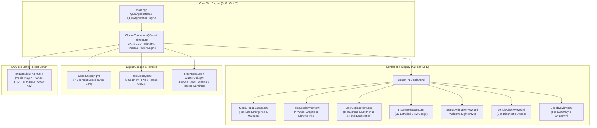

# Next-Gen Automotive Digital Instrument Cluster & Cockpit HMI


<p align="center">
  
  
  
  
  
  
  
</p>

A production-grade, photorealistic Automotive Digital Instrument Cluster HMI for the Hyundai Exter AMT (Smart Auto), engineered using Qt 6 (QML / Qt Quick) and modern C++20. Features authentic Hyundai typography, 1:1 OEM telltale layouts, dynamic multi-page trip computing, full 4-wheel TPMS simulation, an autonomous driving engine, standby power management with door-wake reactivity, and an infotainment media bridge.

---

## Release Notes - Version 2.1.0 (Updated: September 3, 2026)

### 1. AMT Powertrain Simulation (Speed-Coupled Gear Shifts and Engine RPM)

- Hyundai Exter 1.2L Kappa 5-Speed Smart Auto AMT logic fully integrated into the C++ simulation engine.
- Vehicle speed directly drives automatic gear selection: D1 (0-16 km/h), D2 (17-34 km/h), D3 (35-58 km/h), D4 (59-82 km/h), D5 (83+ km/h).
- Engine RPM curve calculated realistically per gear using gear-ratio fraction interpolation with a brief RPM drop on every upshift.
- Both left (speedometer) and right (tachometer) concentric arc lines 2 through 5 illuminate based on speed thresholds (30, 60, 90, 120 km/h) instead of a separate RPM input.
- Removed the manual RPM slider from the ECU Simulator. RPM is now fully automatic, derived from speed and gear state. A live AMT RPM readout is displayed in the bench panel.

### 2. Accurate Live Trip Telemetry (Distance, Time, and Fuel Economy per Page)

- All three trip pages - Drive Info, Since Refuelling, and Accumulated Info - now accumulate distance (km), elapsed driving time (h:m), and average fuel economy (km/L) independently and update in real time as the speed slider changes.
- Root cause of the non-updating trip display identified and fixed: the C++ setters were overwriting the internal floating-point accumulator with a rounded display value each tick, causing sub-0.1 km increments to be silently discarded.
- Introduced separate raw accumulator variables (m_rawTripKm, m_rawRefuelKm, m_rawAccumKm) that are never touched by the Qt property setters, ensuring precise accumulation across all ticks.
- Same fix applied to both the manual speed mode and the auto demo drive mode.
- Odometer (ODO) and Estimated Range (DTE) counters use the same raw accumulator pattern via m_rawOdoAcc and m_rawDteAcc, replacing static local variables that could not be reset.

### 3. Trip Timer Accuracy and Reset Fix

- Timer now advances only when the vehicle is moving (speed greater than 0). Previously it ticked at idle, causing the elapsed time to show random non-zero values at startup.
- The fractional second accumulator was previously declared as a static local inside the simulation tick function, making it impossible to reset between sessions. Moved to m_engineSecAcc, a proper member variable initialized to zero.
- All three reset functions (resetTrip, resetSinceRefuel, resetAccumInfo) now correctly zero their corresponding raw distance accumulators, litre accumulators, second counters, and the engine time accumulator.
- All trip member variable initial values corrected from hardcoded demo values (e.g. "0:42", 154.9 km, 3454.0 km) to clean zeros so the cluster starts fresh on every launch.

### 4. Demo Drive Simulation Card (Premium ECU Bench Control)

- The flat one-line demo drive toggle button has been replaced with a live telemetry control card in the ECU Simulator panel.
- When idle: compact 44 px row with a grey status LED and a cyan START button.
- When running: animates to 86 px showing a pulsing green LED, a live scenario label (e.g. Highway Cruise Control 100 km/h Active), an animated speed progress bar (0-120 km/h range), and a red STOP button.
- Speed bar uses three colour states: orange for idle/stop, blue for city speed (5-60 km/h), and green for highway (60+ km/h), each transitioning with a 400 ms colour animation.
- Border pulses with a glowing green animation while the simulation is active.
- All static local variables in the demo tick loop (cycleTime, prevGearNum, odoAcc, dteAcc) promoted to member variables (m_demoCycleTime, m_demoPrevGear, m_rawOdoAcc, m_rawDteAcc) so the demo resets cleanly each time it is started.

### 5. Fuel Range Display at Zero Fuel

- When the fuel gauge reaches 0 bars, the Estimated Range (DTE) field in the center TFT displays three dashes (---) instead of 0 km, matching the OEM Hyundai Exter instrument cluster behavior.

### 6. Welcome Screen Concentric Line Sequencing

- During the welcome animation (StateInitialStartup), all five concentric arc lines on both gauge rings are lit in glowing blue.
- When the welcome animation ends and the system check begins (StateBootCheck), all lines collapse to only line 1 (the baseline arc).
- The system check then runs with only the single baseline line active, matching the authentic OEM power-on sequence.

### 7. Hyundai Sans Head Font Name Table Patch

- All three Hyundai Sans Head typeface files (Regular, Medium, Bold) had a broken OpenType name table with no registered family name (nameID 1 was absent), causing Qt to log a missing font family warning on every launch.
- The font files were patched in-place using Python fonttools to inject correct name records: family "Hyundai Sans Head", styles Regular / Medium / Bold.
- QML files that used CSS-style font stacks (Hyundai Sans Head, Segoe UI, Roboto, Helvetica, Arial, sans-serif) were updated to the single Qt-compatible family name "Hyundai Sans Head". Qt does not support comma-separated font fallback stacks in the font.family property.
- The console now prints QList("Hyundai Sans Head") for all three weights with no font alias warnings.

---

## Release Notes - Version 2.0.0 (Updated: September 2, 2026)

### 1. OEM Infotainment & Media Popup Banner (Top-Line Emergence & Marquee)

<p align="center">
  
</p>

- Top-Line Emergence: The media banner glides out smoothly directly from inside the top white TFT divider line (520ms entrance with OutCubic easing) rather than dropping from outside the housing.
- 5-Second Auto-Dismiss: Stays visible for 5 seconds upon starting or switching tracks, then glides back up into the top line.
- Every-Song Re-Triggering: Switching songs always re-triggers the slide-out entrance and resets the text position to start.
- Marquee Text Scrolling:
  - Short track titles stay centered.
  - Long song and artist titles hold for 1.2 seconds at the start, glide smoothly horizontally to reveal the full title, hold for 1.2 seconds at the end, and glide back in a continuous loop.
- Official OEM Source Icons:
  - USB: Authentic USB drive with metal connector and engraved USB trident.
  - Apple CarPlay: Official Apple CarPlay dashboard touchscreen with dock and app grid.
  - Bluetooth Audio: Official high-definition Bluetooth symbol.
  - Android Auto: Official Android Auto chevron arrow.
  - FM Radio: Radio broadcast icon.

---

### 2. Full 4-Wheel Interactive TPMS Control Station

<p align="center">
  
</p>

- 2x2 Interactive Wheel Grid in ECU Simulator:
  - Dedicated cards for Front-Left (FL), Front-Right (FR), Rear-Left (RL), and Rear-Right (RR) tyres.
  - Live Status Readout: Color-coded in Green (OK >= 32 PSI), Yellow/Amber (Low 26-31 PSI), and Red (Flat/Puncture < 26 PSI).
  - Steppers: Fine-tune each tyre pressure in 1 PSI increments.
  - Quick One-Touch Presets: Low 24, Flat 16, and OK 35 per tyre.
- Master Calibration & Unit Switcher:
  - Calibrated vs Drive to Display modes.
  - Live unit conversion between psi, kPa, and bar across cluster and simulator.
- Center Vehicle Diagram Reaction: Under-inflated tyres pulse with authentic amber/red glowing pills, triggering the cluster TPMS telltale and amber TFT accent lines.

---

### 3. Standby Ignition-OFF Mode with Door-Wake Reactivity

<p align="center">
  
</p>

- State 5 (Ignition OFF / Standby):
  - When all doors are closed, the entire instrument cluster is 100% pitch black (total dark, zero dials, zero background glow).
- Door-Wake Reactivity:
  - Opening any door, bonnet, or trunk instantly wakes the central TFT display.
  - Displays pure crisp white curved top and bottom divider lines, the large centered vehicle animation showing open door swings and blinking red hazard hoods, and ONLY the Odometer at the bottom right (temperature, gear, and DTE headers remain hidden).
  - Closing all doors smoothly fades the cluster back to 100% total darkness.

---

### 4. Pixel-Locked Zero-Movement Car Door Animation & Hazard Glows

<p align="center">
  
</p>

- Zero-Drift Pixel Lock: All 19 car door animation frames are mathematically normalized against the base chassis (0.000 pixel drift). When doors open or close, the chassis, roof, windshield, and wheels remain completely motionless — only the door flaps physically swing outward.
- Contoured Bonnet & Trunk Hazards: Photorealistic red hazard glow overlays following the exact vehicle body stamping lines, pulsing at a 400ms cadence.

---

### 5. Regional Multi-Language Localization (English & Hindi)

<p align="center">
  
</p>

- Real-Time Language Switching: Seamlessly toggle between English and Hindi (हिन्दी) through the User Settings menu (`Settings -> Language -> English / हिन्दी`).
- Full Vernacular Localization: All primary categories, submenus, vehicle diagnostics, prompts, and settings translated into authentic OEM Hindi terminology:
  - चालक सहायता (Driver assistance)
  - क्लस्टर (Cluster)
  - लाइट्स (Lights)
  - डोर (Door)
  - सुविधा (Convenience)
  - यूनिट सेटिंग (Unit setting)
  - भाषा (Language)
  - सेटिंग्स रीसेट करें (Reset settings)
- Responsive Devnagari Typography: Integrated with clean Unicode line spacing and dynamic centering across all TFT views.

---

### 6. Autonomous Dynamic Driving Simulation Engine & OEM Telltales

<p align="center">
  
</p>

- Multi-Phase Driving Cycle (approx. 60 seconds realistic highway/city loop):
  - Phase 1: City Start & Acceleration (0 to 45 km/h) with automatic gear shifting D1 to D2 to D3.
  - Phase 2: Left Lane Change with automatic Left Turn Signal (3s flashing).
  - Phase 3: Highway Ramp Acceleration (55 to 105 km/h) through D4 to D5 with matching RPM powerband curves.
  - Phase 4: Highway Cruise Control locked at 100 km/h with green CRUISE telltale.
  - Phase 5: Right Lane Exit with automatic Right Turn Signal (3s flashing).
  - Phase 6: Deceleration / Coasting (80 to 0 km/h) with instant fuel economy maxing out at 30 km/L.
  - Phase 7: Traffic Light Idle at 0 km/h with idle RPM (0.8 x1000 RPM).
- Realigned OEM Telltales: Master Warning on Far-Left and Bulb Fault on Bottom-Left matching physical cluster blueprints.

---

## Feature Gallery

<p align="center">
  
  
</p>

<p align="center">
  
  
</p>

<p align="center">
  
  
</p>

<p align="center">
  
  
</p>

---

## System Architecture



---

## Controls & Steering Wheel Switches

You can operate the cluster using either the ECU Simulator Bench ([F12] or [Tab]) or keyboard shortcuts:

| Steering Switch | Keyboard Key | Action |
| :--- | :--- | :--- |
| INFO / TAB | [ I ] | Cycle between Trip Computer, User Settings, and TPMS tabs |
| UP | [ Up Arrow ] | Scroll up / Previous trip page / Brightness increment |
| DOWN | [ Down Arrow ] | Scroll down / Next trip page / Brightness decrement |
| OK | [ Enter ] / [ Return ] | Enter submenu / Toggle checkbox / Select option |
| BACK | [ Esc ] / [ Backspace ] | Return to previous parent menu |
| THROTTLE | [ Right Arrow ] / [ Left Arrow ] | Accelerate / Decelerate speed and RPM |
| PARK BRAKE | [ B ] | Toggle Handbrake telltale |
| AUTO DRIVE | [ A ] | Start/Stop autonomous driving simulation |
| IGNITION | [ O ] | Toggle Ignition ON / OFF standby mode |
| SIMULATOR | [ F12 ] / [ Tab ] | Open/Close ECU Simulator Bench panel |

---

## Build & Run Instructions

### Prerequisites
- Qt 6.5+ (Qt Quick, QML, Core, Gui, Multimedia, Svg)
- CMake 3.20+
- C++20 compatible compiler (Clang / GCC / MSVC)
- Ninja or Make

### Quick Start
```bash
# Clone the repository
git clone https://github.com/skrehanahamed/hyundai-exter-cluster.git
cd hyundai-exter-cluster

# Configure and build
mkdir build && cd build
cmake .. -GNinja
ninja

# Run the cluster application
./HyundaiExterClusterApp
```

Or using the built-in Makefile:
```bash
make run
```

---

## Project Structure

```text
hyundai-exter-cluster/
├── CMakeLists.txt            # CMake build configuration and QML type registration
├── Makefile                  # Helper make targets (run, build, clean)
├── README.md                 # Complete project documentation
├── assets/
│   ├── cluster_preview.png   # Full digital cluster overview screenshot
│   └── features/             # Feature screenshots and component illustrations
├── src/
│   ├── main.cpp              # Application entry point & QML engine initialization
│   ├── ClusterController.h   # C++ controller (CAN/ECU state, Media, TPMS, Power, Themes)
│   └── ClusterController.cpp # Simulation logic, driving loops, and properties
├── qml/
│   ├── Main.qml              # Root application window & global keyboard handlers
│   ├── ClusterUnit.qml       # Main cluster frame & gauge layout container
│   ├── center/
│   │   ├── CenterTripDisplay.qml   # Central TFT controller (Media Popup, Tabs, DTE, ODO)
│   │   ├── InstantEcoGauge.qml     # 3D curved instant ECO gauge
│   │   ├── UserSettingsView.qml    # OEM User Settings with subpages & Hindi localization
│   │   ├── TpmsDisplayView.qml     # 3D top-down TPMS screen with tyre warning glow
│   │   ├── StartupAnimationView.qml # Welcome light wave sequence
│   │   ├── VehicleCheckView.qml    # Startup vehicle self-check sweep
│   │   └── GoodbyeView.qml         # Trip summary & shutdown sequence
│   ├── gauges/
│   │   ├── SpeedDisplay.qml        # Digital speed readout & arc graphics
│   │   ├── RpmDisplay.qml          # Digital RPM readout & gauge styling
│   │   └── SevenSegmentDigit.qml   # Custom 7-segment display component
│   ├── frame/
│   │   └── BlueFrame.qml           # Outer bezel and background glow frame
│   └── simulator/
│       └── EcuSimulatorPanel.qml   # Interactive ECU test bench (Media, TPMS, Auto-Drive, Doors)
└── resources/
    ├── fonts/                # Authentic Hyundai Sans Head & automotive typography
    ├── icons/                # OEM telltales, media icons (USB, CarPlay, BT), TPMS car
    └── audio/                # Turn signal ticks and warning chimes
```

---

## License
This project is created for educational, portfolio, and automotive UI/UX demonstration purposes.
